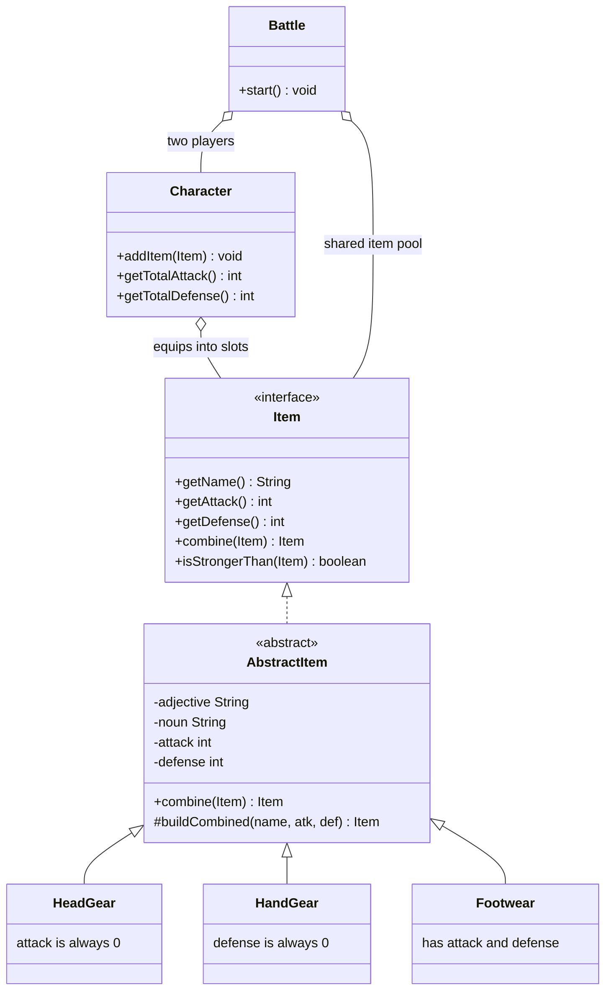

<div align="center">

# Role Playing Games: Battle Simulator

### A turn-based RPG battle simulator in Java, where characters equip gear, items auto-combine when slots fill up, and a greedy rule decides each turn

[](https://openjdk.org/)
[](https://junit.org/)
[](https://www.khoury.northeastern.edu/)
[](LICENSE)

</div>

---

## Demo

This is a console application, so there is no website to visit. The `Main` class runs a sample battle and prints the result.

<!-- ADD A SAMPLE RUN HERE.
     Take a screenshot of your terminal running the battle, save it in docs/screenshots/,
     and uncomment the line below. A short terminal recording (asciinema or a .gif) works too. -->

<!--  -->

---

## What is this, in plain English?

Two characters face off. Each one has base attack and defense, plus slots for gear: one head item, two hand items, and two foot items. They take turns picking from a shared pool of items and equipping them to get stronger. When the items run out, whoever would take less damage wins.

Two rules make it interesting:

- **Items auto-combine.** If a slot is already full and you add another item of that type, the new item is not rejected. It merges with what is already there into a single, stronger item.
- **Each turn is a greedy choice.** A character does not pick at random. It follows a priority rule: first fill an empty slot type, then take the highest attack, break ties on defense, and only pick randomly if everything is equal.

---

## Why it's interesting

This was built for CS5010 (Programming Design Paradigm) at Northeastern, so the goal was clean object-oriented design. The parts worth a look:

- **Template Method pattern.** `AbstractItem` holds the shared `combine()` logic but delegates the final step to an abstract `buildCombined()` that each subclass implements, so every item type returns its own concrete type without duplicating the combine code.
- **Immutability.** The gear classes are `final` and their fields never change. `combine()` returns a brand new item and leaves both originals untouched, which makes the code easier to reason about.
- **Interface default method.** The "is this item stronger" comparison is identical for every type, so it lives as a default method on the `Item` interface instead of being copied into each class.
- **Polymorphism over conditionals.** A character routes an incoming item to the right slot by its actual type and handles a full slot by combining, rather than with sprawling if-else logic.
- **Designed to be testable.** `Battle` takes its random source through the constructor, so a test can pass in a seeded `Random` and get the exact same battle every time. No flaky tests.

---

## Design at a glance



---

## Tech Stack

| Area | Choice |
|---|---|
| Language | Java |
| Testing | JUnit |
| Patterns and concepts | Template Method, interface default methods, immutability, polymorphism, greedy selection, dependency injection for testability |

---

## Getting Started

### Prerequisites
- A Java Development Kit (JDK 17 or newer)

### Compile and run
```bash
javac -d out src/*.java
java -cp out Main
```

### Run the tests
The tests under `test/` use JUnit. The easiest way to run them is to open the project in IntelliJ IDEA and run the test classes, or add JUnit to your classpath and run them from the command line.

---

## Project Structure

```
.
├── src/
│   ├── Item.java          # The item contract (interface)
│   ├── AbstractItem.java  # Shared combine logic + abstract buildCombined()
│   ├── HeadGear.java      # Head slot item (defense only)
│   ├── HandGear.java      # Hand slot item (attack only)
│   ├── Footwear.java      # Foot slot item (attack and defense)
│   ├── Character.java     # Equips items into slots, combines when full
│   ├── Battle.java        # Runs the turn-based battle and picks a winner
│   └── Main.java          # Sample battle entry point
└── test/
    ├── CharacterTest.java
    └── ItemTest.java
```

---

## What I Learned

This project was about getting object-oriented design right: pulling shared behavior into a base class while letting subclasses fill in the specifics, keeping objects immutable, letting types do the branching instead of long if-else chains, and structuring the code so that even the random parts are testable. Small program, but the design habits carry straight over to larger systems.

---

## Author

**Pubudu Gunasekara**
M.S. Computer Science, Northeastern University (Silicon Valley)
Backend and distributed systems. Open to a software engineering co-op (Jan to Aug 2027).

[](https://pubudugunasekara.github.io/)
[](https://www.linkedin.com/in/pubudugunasekera/)
[](https://github.com/PubuduGunasekara)

---

<div align="center">

**Thanks for checking out this project.**
If you found it useful or interesting, consider leaving a star, and feel free to reach out about backend, distributed systems, or co-op opportunities.

Built by Pubudu Gunasekara · MIT License

</div>
